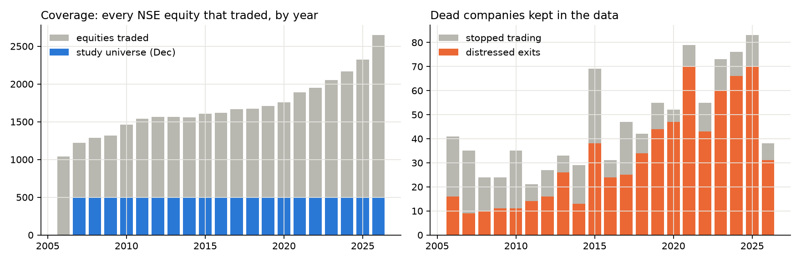
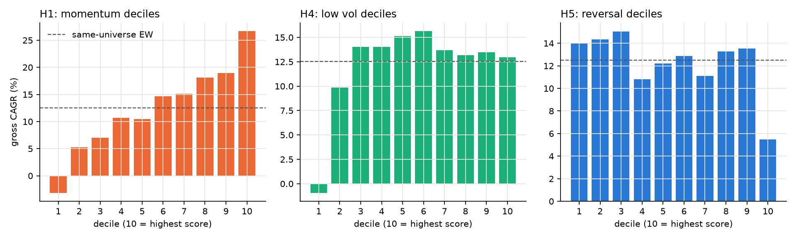
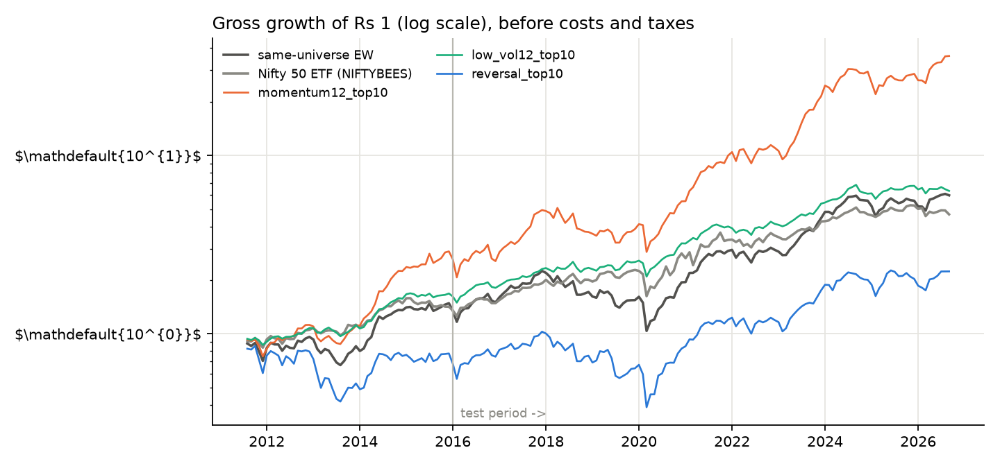
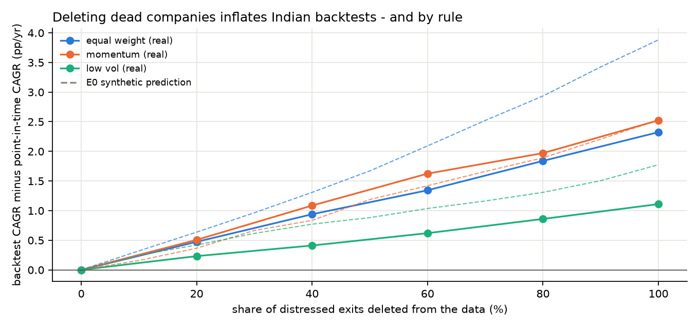
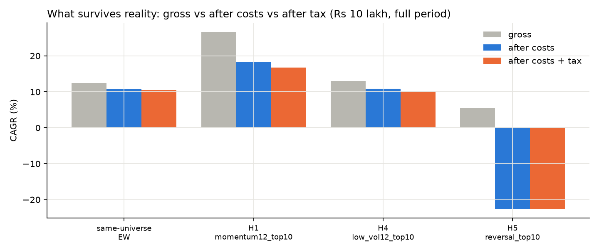
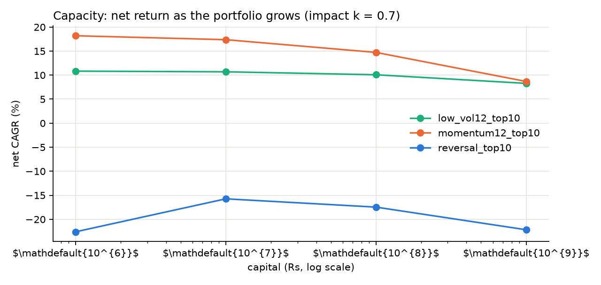
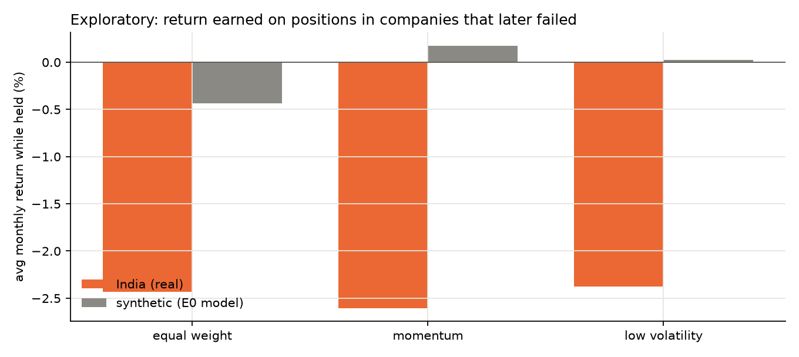
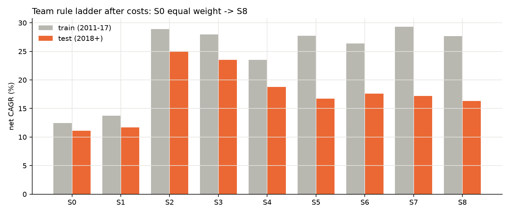
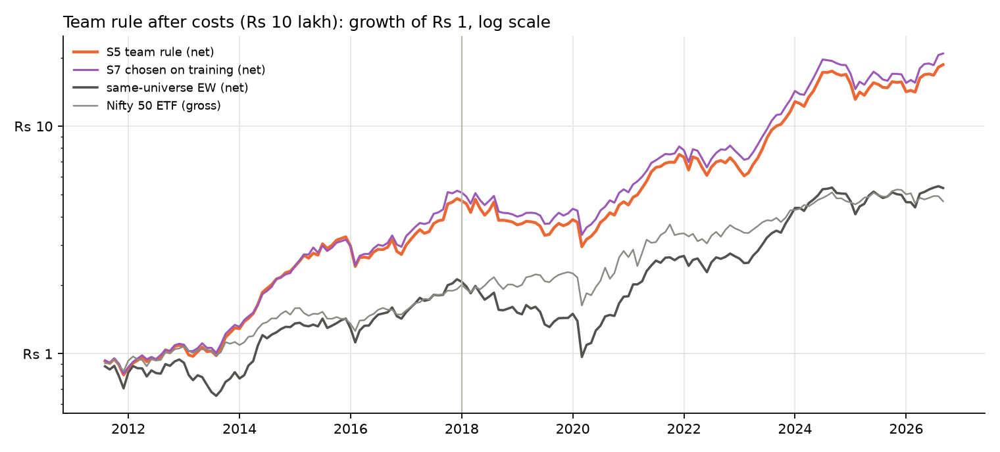

# Do Momentum, Value and Mean-Reversion Strategies Still Work in Indian Equities After Costs, Taxes, Liquidity and Data-Mining Bias?

*A pre-registered replication study on every stock traded on NSE, 2006-2026*

**Data:** 5,123 NSE daily files (2006-01-02 to 2026-09-25), 8,353,240 security-days, 3,949 securities including 678 that failed or were delisted in distress.
**Code and data pipeline:** `india-anomaly-lab` (commit `bd892fc`); every result below is regenerated by `scripts/run_all.sh`.
**Pre-registration:** git tags `prereg-v1`, `prereg-v1-amend1`, `prereg-v1-amend2`.

---

## 1. Answer in one page

**The question.** Do common momentum, value and mean-reversion strategies in Indian equities continue to work after accounting for transaction costs, taxes, liquidity and data-mining bias?

**The answer, strategy by strategy** (primary sample Aug 2011 - Sep 2026, Rs 10 lakh portfolio; "EW" = equal weight of the same 500 most-liquid stocks each month, the fair control):

| Strategy | Reproduces the published anomaly? | Survives costs and tax? | Survives out-of-sample and data-mining tests? | Liquidity and other notes |
|---|---|---|---|---|
| Momentum (12-1 months, top decile) | Yes: long-short t = 4.72; gross 26.7% vs EW 12.5% | **Yes.** 23.9% after costs, 21.9% after costs and tax vs EW 11.7% / 11.4% | Test period 2018+: +11.56 pp/yr, 95% CI [+4.27, +20.64]; SPA p < 0.001 over 12 variants | Edge shrinks with size: 22.9% at Rs 1 crore, 19.7% at Rs 10 crore, 12.8% at Rs 100 crore (about EW). Drawdown -46% |
| Short-term reversal (last month's losers) | No: long-short t = -1.61 (wrong sign); top decile 5.5% vs EW 12.5% | **No.** -3.1% after costs; turnover 90% a month costs 8.6 pp a year | Fails the pre-registered criterion (interval entirely below zero) | Costs, not data, kill it |
| Low volatility (calmest decile) | Risk-adjusted only: Sharpe 1.00 vs 0.64 (95% CI of the difference [0.12, 0.60]), return 12.9% vs EW 12.5% | **Risk cut, not extra return.** 12.0% after costs, 11.1% after tax, versus EW 11.7% / 11.4% | Return difference vs EW not significant (interval spans zero) | Worst fall -19% vs EW -54% |
| 52-week-high | Yes gross (22.8%) | Partly: 16.4% after costs | Test-period excess +3.3 pp, interval [-4.9, 10.8] spans zero | Not distinguishable from EW after costs |
| Value (fundamental) | **Untestable over the full sample**: NSE publishes P/E only from 2024 | 31 months only: -0.4% vs EW 2.1% | 95% interval of gross difference -9.1% to 2.9%: inconclusive | Needs a licensed historical fundamentals database |
| Value proxies (price-based) | Long-term reversal 6.3%, cheap vs 5-year mean -2.1% gross | **No.** 4.6% and -3.7% after costs | Both below EW; the second is significantly below | Failed models are reported |

**Five findings that matter beyond any single strategy**

1. **Momentum is the one anomaly that clearly survives**, but it is a small-capital result. The net edge over EW is about +12.2 pp a year at Rs 10 lakh and disappears near Rs 100 crore.
2. **Using today's list of big companies to test the past inflates a momentum backtest by +21.7 percentage points a year**, more than doubling the true return (26.7% true vs about 48.4% apparent). This is by far the largest data error measured, and it is the error most amateur backtests make.
3. **Quietly deleting failed companies inflates every rule by +1.1 to +2.5 pp a year.** A pre-registered simulation predicted equal-weight portfolios would be hurt most; in India momentum was hurt as much or more (hypothesis H6 refuted), because momentum portfolios kept holding failing companies while they collapsed (Section 8).
4. **The team's 30-stock trend-and-setup rule (S5) cuts drawdown (-39% vs EW -54%) and beat EW over the full sample, but its edge is not statistically reliable in the untouched test period** (+5.62 pp/yr, 95% CI [-0.82, +12.03]), and it earns less than plain top-30 momentum (26.7% after costs).
5. **8 of 26 models pass the pre-registered failure criterion individually, but that is before correcting for having tried 26.** After correction only the momentum family is convincing (Section 7).

---

## 2. Design

**Question and scope.** Momentum, value and mean-reversion anomalies, long-only implementable portfolios, Indian cash equities (NSE), investor: a resident individual (delivery trades, retail capital Rs 10 lakh with capacity tests to Rs 100 crore). No shorting, no leverage, no derivatives. No real-money trading.

**Pre-registration.** Hypotheses, universe, timing, costs, taxes, tests and sample split were written and frozen in git (`prereg-v1`) before any strategy return was computed on real data. The experiment code refuses to run on real data unless the frozen document is unchanged. Two dated amendments exist and are disclosed in Section 10: Amendment 1 (a bug fix after the first run, with the pre-fix results kept) and Amendment 2 (the team-rule and value-proxy extension, declared and tagged before those results were computed).

**Hypotheses (original).**

| ID | Hypothesis | Evidence | Supported |
|---|---|---|---|
| H1 | 12-1 momentum long-short earns a positive gross return | mean 2.09%/month, Newey-West t = 4.72 | yes |
| H2 | Momentum top decile beats same-universe EW net of costs and taxes (test period) | +11.56 pp/yr, 95% CI [+4.27, +20.64] | yes |
| H3 | The best grid variant beats EW after correcting for all variants tried | SPA p = 0.000, Reality Check p = 0.000 (12 variants) | yes |
| H4 | Low-volatility decile has a higher Sharpe ratio than EW (gross) | Sharpe 1.00 vs 0.64; 95% CI of difference [0.12, 0.60] | yes |
| H5a | 1-month reversal long-short is profitable gross | mean -0.50%/month, t = -1.61 | no |
| H5b | Reversal top decile does NOT beat EW net of costs (test period) | -10.54 pp/yr, 95% CI [-14.62, -6.46] | yes |
| H6 | Deleting dead companies inflates EW more than momentum and low-volatility (E0 prediction) | bias at 100% deletion: EW +2.32, momentum +2.52, low-vol +1.11 pp/yr | no |

**Extension hypotheses (Amendment 2).**

| ID | Hypothesis | Evidence | Supported |
|---|---|---|---|
| X1 | S5 beats same-universe EW net of costs (test period) | +5.62 pp/yr, 95% CI [-0.82, +12.03] | no |
| X2 | Rule chosen on training data (S7) beats EW net (test period) | +6.08 pp/yr, 95% CI [-0.68, +12.35] | no |
| X3 | S5 has a smaller net max drawdown than EW (full sample) | S5 -38.6% vs EW -54.5% | yes |
| X4 | Long-term reversal (decile) beats EW net (test period) | -4.80 pp/yr, 95% CI [-12.11, +4.39] | no |
| X5 | Cheap vs 5y mean (decile) beats EW net (test period) | -12.45 pp/yr, 95% CI [-19.46, -3.89] | no |

**Pre-registered failure criterion ("does not survive").** The top-decile portfolio's net-of-cost CAGR minus same-universe EW net-of-cost CAGR has a 95% stationary-bootstrap interval that includes zero (or lies below) in the untouched test period (2018 onward).

**Samples.** Primary: holding months Aug 2011 - Sep 2026 (every 12-month signal window lies inside the period covered by NSE's official corporate-action records). Train Aug 2011 - Dec 2017, test Jan 2018 onward. Extended (robustness only): from 2007, using a validated split detector before mid-2010.

---

## 3. Data

**Source.** NSE's own daily cash-market files (bhavcopies), one per trading day. Each file lists every security that traded that day, including companies that were later delisted, so a history assembled from them is point-in-time by construction: 5,123 files, 8,353,240 security-days, 3,949 securities after linking. Series EQ, BE and BZ are kept (stocks are moved to the trade-for-trade segments when in trouble, so dropping them would itself create survivorship bias). ETFs and fund units are excluded from the stock universe; NIFTYBEES is the investable benchmark.

**Things that had to be discovered and fixed** (all in `docs/LAB_NOTEBOOK.md`):

- **NSE prices are not adjusted for splits or bonuses.** On an ex-date the previous close is unadjusted (HDFC Bank's 2019 2:1 split appears as a -50% day). Adjustment factors come from NSE's official corporate-action records (1,059 split/bonus factors applied from records). Records are incomplete (for example no entry for some 2025 bonuses), so large unrecorded overnight gaps that match a standard ratio are adjusted by a detector (782 gap-fill and 335 pre-2010 adjustments). The detector's parameters were tuned on the early records and its accuracy measured on later ones (precision 82%, recall 89%; the precision is a lower bound because some "false positives" are real events missing from the records).
- **A stock at its 20% daily limit looks exactly like a 1:4 bonus** (both a 1.25 price ratio), so gap-based detection excludes small ratios.
- **ISINs change when a company splits its shares**, so identity is linked through symbol continuity, ISINs and NSE's symbol-change list (631 symbol-change links, 505 ISIN links, 14 reused symbols split apart, 17 sessions absent from the archive bridged).
- **File formats changed** (two-digit years in some 2020 files; ISO dates and new file names in the 2026 corporate-action files). The 2026 change silently produced zero records until a known split (Kotak Bank, Jan 2026) exposed it.
- **Demergers** appeared as 40-65% one-day losses (Tata Motors 2025, Vedanta 2026, Siemens 2025, Tata Chemicals 2020...). 130 recorded demergers are treated as value-neutral on the ex-date.

**Coverage after fixes.** 1,670 unexplained overnight gaps larger than 40% remain across all securities and years, of which 16 are in liquid stocks (splits with non-standard ratios, demergers and rights issues that neither the records nor the detector covered, so each shows as a spurious large loss); all are listed in `results/real/e1_unexplained_gaps.csv`. Dead companies are in the data every year:

| year | sessions | equities traded | stopped trading | distressed exits | universe size (Dec) | 500th stock's median daily value (Rs crore) |
|---|---|---|---|---|---|---|
| 2006 | 247 | 1041 | 41 | 16 | n/a | n/a |
| 2007 | 249 | 1218 | 35 | 9 | 500 | 0.32 |
| 2008 | 246 | 1285 | 24 | 10 | 500 | 0.07 |
| 2009 | 242 | 1319 | 24 | 11 | 500 | 0.53 |
| 2010 | 251 | 1464 | 35 | 11 | 500 | 0.89 |
| 2011 | 247 | 1537 | 21 | 14 | 500 | 0.23 |
| 2012 | 247 | 1566 | 27 | 16 | 500 | 0.36 |
| 2013 | 248 | 1565 | 33 | 26 | 500 | 0.18 |
| 2014 | 243 | 1559 | 29 | 13 | 500 | 1.23 |
| 2015 | 248 | 1607 | 69 | 38 | 500 | 1.03 |
| 2016 | 246 | 1616 | 31 | 24 | 500 | 1.47 |
| 2017 | 248 | 1668 | 47 | 25 | 500 | 2.48 |
| 2018 | 246 | 1673 | 42 | 34 | 500 | 1.37 |
| 2019 | 244 | 1709 | 55 | 44 | 500 | 0.84 |
| 2020 | 251 | 1754 | 52 | 47 | 500 | 2.64 |
| 2021 | 248 | 1887 | 79 | 70 | 500 | 6.99 |
| 2022 | 248 | 1952 | 55 | 43 | 500 | 6.41 |
| 2023 | 245 | 2053 | 73 | 60 | 500 | 13.16 |
| 2024 | 249 | 2167 | 76 | 66 | 500 | 20.57 |
| 2025 | 249 | 2325 | 83 | 70 | 500 | 15.85 |
| 2026 | 181 | 2646 | 38 | 31 | 500 | 21.37 |

---

## 4. Methods

**Universe (known at the time).** At each month-end, the 500 securities with the highest median daily traded value over the previous 6 months, among those priced at least Rs 20, with at least 13 months of history, at least 10 trading days that month, and trading in the final week. It is a liquidity-ranked proxy for a broad index, point-in-time by construction (the historical Nifty 500 membership cannot be rebuilt reliably from free data).

**Timing (no look-ahead).** Signal from data through the month-end; buy at the first open of the next month; hold to the first open of the month after. A unit test shows that changing future prices never changes a past portfolio.

**Signals.** Momentum (return from t-12 to t-1), 1-month reversal, low volatility (12-month daily volatility), 52-week high, and (extension) long-term reversal (t-60 to t-13) and price relative to its 5-year mean. Top decile or quintile, equal weighted.

**Costs.** Statutory charges by trade date (STT, stamp duty, NSE and SEBI fees, GST, depository charge per scrip sold), a half-spread from the Abdi-Ranaldo daily estimator, and square-root market impact (k = 0.7, sensitivities at 0 and 1.5). A discount broker (brokerage 0); a 0.3% brokerage sensitivity. Continuing positions are traded only when more than 25% from target.

**Taxes.** Resident individual: FIFO lots, short- and long-term capital-gains rates by sale date (LTCG exempt before April 2018, grandfathered to 31 Jan 2018, Rs 1 lakh then Rs 1.25 lakh annual exemption, 12.5% LTCG and 20% STCG from July 2024), loss set-off and 8-year carry-forward, cess, tax paid each April, liquidation taxed at the end. Cash earns 6% a year in rules that hold cash (untaxed approximation).

**Statistics.** Newey-West t-statistics; stationary block bootstrap (mean block 12 months, 5,000 draws) for CAGR differences; Hansen's Superior Predictive Ability test (primary) and White's Reality Check for data mining across all variants; deflated Sharpe ratios; sub-period and extended-sample checks; delisting-return, dividend, spread-floor and brokerage sensitivities.

**Validation.** A synthetic market with known truth (E0) and a fake NSE archive with splits, renames, symbol reuse and missing files are used to test the code; the pipeline must reproduce the known returns exactly (27 tests). White's Reality Check was found to miss a genuine edge hidden among noisy variants in one of these tests, which is why SPA is the primary data-mining test.

---

## 5. Results 1: do the anomalies exist? (gross of costs)

| portfolio | type | CAGR full | CAGR 2011-17 | CAGR 2018+ | Sharpe | max DD | NW t |
|---|---|---|---|---|---|---|---|
| same-universe EW | benchmark | 12.5% | 13.5% | 11.8% | 0.64 | -54% | 2.40 |
| Nifty 50 ETF (NIFTYBEES) | benchmark | 10.7% | 10.7% | 10.7% | 0.65 | -29% | 3.03 |
| momentum12_top10 | long-only top | 26.7% | 28.3% | 25.5% | 1.05 | -43% | 3.86 |
| momentum12_top10 | long-short top-bottom | 25.1% | 22.6% | 27.0% | 1.13 | -31% | 4.72 |
| momentum12_top20 | long-only top | 22.9% | 23.6% | 22.4% | 1.00 | -38% | 3.76 |
| momentum12_top20 | long-short top-bottom | 17.6% | 14.3% | 20.1% | 0.98 | -28% | 4.16 |
| momentum6_top10 | long-only top | 22.5% | 22.9% | 22.2% | 0.92 | -39% | 3.53 |
| momentum6_top10 | long-short top-bottom | 20.7% | 22.0% | 19.8% | 1.04 | -25% | 4.59 |
| momentum6_top20 | long-only top | 21.0% | 21.7% | 20.4% | 0.92 | -42% | 3.45 |
| momentum6_top20 | long-short top-bottom | 14.6% | 15.0% | 14.2% | 0.93 | -24% | 4.35 |
| reversal_top10 | long-only top | 5.5% | 0.4% | 9.3% | 0.33 | -62% | 1.35 |
| reversal_top10 | long-short top-bottom | -7.3% | -17.7% | 1.2% | -0.34 | -70% | -1.61 |
| reversal_top20 | long-only top | 9.6% | 5.5% | 12.7% | 0.47 | -57% | 1.89 |
| reversal_top20 | long-short top-bottom | -3.6% | -12.5% | 3.4% | -0.18 | -59% | -0.85 |
| low_vol12_top10 | long-only top | 12.9% | 13.9% | 12.2% | 1.00 | -19% | 3.88 |
| low_vol12_top10 | long-short top-bottom | 4.4% | 9.8% | 0.6% | 0.29 | -68% | 1.16 |
| low_vol12_top20 | long-only top | 13.3% | 15.8% | 11.4% | 0.95 | -23% | 3.53 |
| low_vol12_top20 | long-short top-bottom | 1.2% | 5.0% | -1.6% | 0.16 | -66% | 0.65 |
| low_vol6_top10 | long-only top | 13.1% | 14.8% | 11.8% | 1.01 | -19% | 3.74 |
| low_vol6_top10 | long-short top-bottom | 7.5% | 13.2% | 3.4% | 0.41 | -58% | 1.59 |
| low_vol6_top20 | long-only top | 14.0% | 16.7% | 12.0% | 0.97 | -27% | 3.63 |
| low_vol6_top20 | long-short top-bottom | 3.1% | 6.7% | 0.6% | 0.25 | -60% | 0.99 |
| high_52w_top10 | long-only top | 22.8% | 26.1% | 20.4% | 1.19 | -30% | 4.27 |
| high_52w_top10 | long-short top-bottom | 18.4% | 25.5% | 13.5% | 0.79 | -39% | 3.36 |
| high_52w_top20 | long-only top | 21.8% | 25.5% | 19.2% | 1.18 | -31% | 4.35 |
| high_52w_top20 | long-short top-bottom | 14.5% | 19.1% | 11.3% | 0.74 | -36% | 3.35 |

The 12 pre-registered variants are all shown. Momentum in every form, and the 52-week-high, reproduce as gross anomalies; low volatility does not earn a higher gross return than EW (its case is about risk); short-term reversal has the wrong sign long-short (t = -1.61) and its long-only top decile earns 5.5% against EW 12.5%. The market benchmark (NIFTYBEES, an investable Nifty 50 ETF) earned 10.7% gross.

---

## 6. Results 2: do they survive survivorship bias, time periods and realistic costs?

### 6.1 Survivorship and look-ahead: how large are the errors? (E4)

Same rules, same period, four data views; bias = CAGR on the view minus CAGR on the point-in-time data (percentage points a year):

| data view | equal weight | momentum | low volatility |
|---|---|---|---|
| Today's top 500 applied to the past | +11.2 | +21.7 | +4.6 |
| Only companies still trading at the end | +2.6 | +3.9 | +1.3 |
| 20% of distressed exits deleted | +0.5 | +0.5 | +0.2 |
| 60% of distressed exits deleted | +1.3 | +1.6 | +0.6 |
| 100% of distressed exits deleted | +2.3 | +2.5 | +1.1 |
| Simulation prediction (E0), all deleted | +3.9 | +2.5 | +1.8 |

The "today's list" error dwarfs everything else because it selects the future winners. Deleting dead companies is smaller but real (217 of the 678 distressed exits were ever in the study universe, about 14 a year). **H6 (the simulation's prediction that equal weight is hurt most) is refuted.**

### 6.2 Different time periods

Momentum's edge is present in both halves of the sample: gross 28.3% in 2011-17 and 25.5% in the untouched 2018+ period (EW 13.5% and 11.8%). Extended sample from 2007: momentum 21.2%, EW 10.7%, NIFTYBEES 9.9%. Cumulative gross return in each episode:

| episode | EW | Nifty 50 ETF | momentum12_top10 | low_vol12_top10 | reversal_top10 |
|---|---|---|---|---|---|
| 2008 crisis | -70.0% | -50.9% | -73.9% | -42.4% | -73.0% |
| 2013 taper tantrum | 3.7% | 8.7% | 16.9% | 5.5% | -6.6% |
| 2016 demonetisation | 5.0% | 6.8% | -0.6% | 2.0% | 2.9% |
| 2020 Covid | 20.5% | 25.4% | 34.2% | 25.1% | 23.3% |
| 2021-24 retail boom | 206.1% | 80.8% | 446.1% | 112.8% | 161.2% |

Momentum did **not** protect in the 2008 crisis (equal to or worse than EW and far worse than the market ETF) and lost ground in 2016 (demonetisation); it did very well in the 2013 taper tantrum, the Covid rebound and, above all, the 2021-24 small-cap boom. The strategy is a trend strategy in a market with pronounced boom-bust episodes, and its record depends on that.

### 6.3 Do results disappear once realistic costs are added? (E3)

Rs 10 lakh, full primary sample:

| portfolio | gross | after costs | after costs and tax | with 0.3% brokerage | with 10 bp spread floor | cost drag (pp/yr) | monthly turnover | net max DD |
|---|---|---|---|---|---|---|---|---|
| same-universe EW | 12.5% | 11.7% | 11.4% | 11.2% | 11.6% | 0.8 | 5% | -54% |
| H1 momentum12_top10 | 26.7% | 23.9% | 21.9% | 21.0% | 23.4% | 2.8 | 28% | -46% |
| H4 low_vol12_top10 | 12.9% | 12.0% | 11.1% | 10.9% | 11.8% | 1.0 | 12% | -19% |
| H5 reversal_top10 | 5.5% | -3.1% | -3.1% | -11.8% | -4.6% | 8.6 | 90% | -78% |

- **Momentum keeps most of its edge**: costs take 2.8 pp and tax 2.0 pp a year, leaving 21.9% versus EW's 11.4%. The result survives a 0.3% brokerage (21.0%) and a 10 bp spread floor (23.4%).
- **Short-term reversal disappears completely**: it trades about 90% of the portfolio every month; costs turn 5.5% gross into -3.1%.
- **Low volatility is cheap to run** (12% monthly turnover) but tax pushes it below EW (11.1% vs 11.4%) because EW rarely sells.

### 6.4 Liquidity and capacity

Net CAGR (no tax) as the portfolio grows, impact coefficient k = 0.7:

| capital | momentum | low volatility | reversal |
|---|---|---|---|
| Rs 10 lakh | 23.9% | 12.0% | -3.1% |
| Rs 1 crore | 22.9% | 11.8% | -2.8% |
| Rs 10 crore | 19.7% | 11.2% | -5.9% |
| Rs 100 crore | 12.8% | 9.3% | -12.3% |

Momentum is a small-investor strategy in India: the stocks that rank highest are often small and thinly traded. By Rs 100 crore its net return (12.8%) is barely above the equal-weight portfolio. The 500th most liquid stock traded only Rs 0.07 crore a day in 2008 and Rs 16 crore in 2025, so liquidity is far better now than in the early years of the sample.

### 6.5 Robustness of the momentum result (E10)

| test | momentum top-decile gross CAGR |
|---|---|
| same-universe EW (reference) |  |
| baseline | 26.7% |
| cap each monthly return at +200% | 26.7% |
| cap each monthly return at +100% | 26.6% |
| cap each monthly return at +50% | 24.7% |
| drop the 10 best position-months (of 9100) | 25.1% |
| drop the 25 best position-months (of 9100) | 23.4% |
| drop the 50 best position-months (of 9100) | 21.1% |
| drop the 100 best position-months (of 9100) | 17.3% |
| floor each monthly return at -50% (worst losses capped) | 27.2% |
| floor each monthly return at -90% (worst losses capped) | 26.7% |
| daily returns > +100% in liquid stocks: 3 (BCG, CCCL, SHREEASHTA); held by the momentum portfolio: 1 |  |

Momentum's advantage is not the product of a few lucky stocks: removing the 50 best of 9,100 position-months still leaves 21.1% against EW 12.5%. Losses are not being hidden either (flooring the worst months barely changes the result). Delisting returns of -30% or -100% for distressed exits change gross CAGRs by at most 0.3 pp. Including dividends (records exist from 2010) adds 0.9 to 1.6 pp a year to each portfolio and does not change the ranking.

---

## 7. Results 3: data-mining bias

Twelve variants were pre-registered and 14 more (team rules and value proxies) were added by dated amendment before their results existed, so the family is 26 variants; every one is reported in Section 9. For the best variant relative to EW (gross, full sample):

| family | SPA p (full) | Reality Check p (full) | SPA p (2018+) | best variant |
|---|---|---|---|---|
| Original 12 variants | <0.001 | <0.001 | <0.001 | momentum12_top10 |
| All 26 variants | <0.001 | <0.001 | <0.001 | momentum12_top10 |

Both tests reject "no variant beats EW" decisively, and the winner is always a momentum variant, so **a real momentum effect exists in this data even after allowing for having searched over many rules.** The deflated Sharpe ratio is a harsher test of whether the specific best portfolio's excess Sharpe (1.13) exceeds what the best of 12 would achieve by luck (0.94): momentum scores 0.75, below the conventional 0.95, so the *magnitude* of the excess return should be treated as uncertain even though its *existence* is not. Reversal and low volatility score essentially 0. Of 26 models, 8 individually pass the failure criterion (interval above zero) at the 5% level; with 26 tries a few passing by chance is expected, which is why the family-wide tests above, not the individual intervals, carry the conclusion.

---

## 8. Why the simulation was wrong about India (E5, exploratory)

The synthetic market assumed firms fail only after their price has fallen. Momentum portfolios sell losers, so in that world they rarely hold failing firms and are hurt least by deleted data. Looking at positions in companies that later failed (average monthly return earned while held):

| rule | India: weight in future failures | India: monthly return on them | Simulation: weight | Simulation: monthly return on them |
|---|---|---|---|---|
| equal weight | 4.6% | -2.43% | 17.0% | -0.44% |
| momentum | 3.6% | -2.60% | 15.8% | 0.18% |
| low vol | 2.6% | -2.38% | 10.3% | 0.02% |

In the simulation, momentum's positions in future failures roughly broke even (0.18% a month); in India they lost 2.60% a month, as badly as equal weight's. Indian momentum portfolios hold companies on the way down. This analysis was not pre-registered and rests on 217 failures that entered the universe; treat it as an explanation to test, not a proven mechanism.

---

## 9. Every model tested, including the failures

Net of costs (Rs 10 lakh, impact k = 0.7), primary sample. "Test excess" is the test-period (2018+) net CAGR minus same-universe EW net CAGR with its 95% bootstrap interval; the last column applies the pre-registered failure criterion to each model separately (before correcting for the number tried).

| model | family | net full | net 2018+ | net after tax | max DD | test excess vs EW (pp) | passes |
|---|---|---|---|---|---|---|---|
| EW (control) | Benchmark | 11.7% | 11.1% | 11.4% | -54% |  |  |
| momentum12_top10 | Original grid | 23.9% | 22.7% | 21.9% | -46% | +11.6 [+4.3, +20.6] | yes |
| momentum12_top20 | Original grid | 20.6% | 20.1% | 19.2% | -40% | +8.9 [+3.8, +14.6] | yes |
| momentum6_top10 | Original grid | 18.5% | 18.2% | 16.3% | -44% | +7.1 [+1.1, +13.1] | yes |
| momentum6_top20 | Original grid | 17.6% | 17.2% | 15.7% | -46% | +6.1 [+1.5, +11.0] | yes |
| reversal_top10 | Original grid | -3.1% | 0.6% | -3.1% | -78% | -10.5 [-14.6, -6.5] | no |
| reversal_top20 | Original grid | 0.7% | 3.8% | 0.5% | -66% | -7.3 [-10.3, -4.3] | no |
| low_vol12_top10 | Original grid | 12.0% | 11.4% | 11.1% | -19% | +0.2 [-11.6, +10.8] | no |
| low_vol12_top20 | Original grid | 12.5% | 10.7% | 11.7% | -23% | -0.4 [-10.1, +8.2] | no |
| low_vol6_top10 | Original grid | 11.4% | 10.3% | 10.3% | -20% | -0.9 [-12.5, +9.4] | no |
| low_vol6_top20 | Original grid | 12.5% | 10.6% | 11.3% | -29% | -0.5 [-9.8, +7.5] | no |
| high_52w_top10 | Original grid | 16.4% | 14.4% | 14.4% | -35% | +3.3 [-4.9, +10.8] | no |
| high_52w_top20 | Original grid | 17.3% | 15.2% | 15.2% | -34% | +4.0 [-2.9, +9.8] | no |
| S1 | Team rule | 12.5% | 11.7% | 11.8% | -49% | +0.6 [-2.3, +2.9] | no |
| S2 | Team rule | 26.7% | 25.1% | 24.3% | -48% | +13.9 [+4.9, +25.2] | yes |
| S3 | Team rule | 25.4% | 23.5% | 23.2% | -50% | +12.4 [+3.1, +23.6] | yes |
| S4 | Team rule | 20.8% | 18.8% | 18.2% | -29% | +7.7 [-1.2, +15.8] | no |
| S5 | Team rule | 21.3% | 16.7% | 20.5% | -39% | +5.6 [-0.8, +12.0] | no |
| S6 | Team rule | 21.2% | 17.6% | 20.4% | -39% | +6.5 [+0.6, +12.4] | yes |
| S7 | Team rule | 22.2% | 17.2% | 21.3% | -36% | +6.1 [-0.7, +12.4] | no |
| S8 | Team rule | 21.0% | 16.3% | 20.2% | -35% | +5.2 [-0.6, +10.3] | no |
| S5_n20 | Team rule (stability) | 22.9% | 18.9% | 22.2% | -39% | +7.8 [+0.8, +15.3] | yes |
| S5_n50 | Team rule (stability) | 18.6% | 15.0% | 17.8% | -37% | +3.9 [-2.0, +9.5] | no |
| ltrev_top10 | Value proxy (price-based) | 4.6% | 6.3% | 4.1% | -74% | -4.8 [-12.1, +4.4] | no |
| ltrev_top20 | Value proxy (price-based) | 7.5% | 9.3% | 6.8% | -66% | -1.9 [-7.7, +5.7] | no |
| cheap5y_top10 | Value proxy (price-based) | -3.7% | -1.3% | -4.1% | -83% | -12.5 [-19.5, -3.9] | no |
| cheap5y_top20 | Value proxy (price-based) | 1.4% | 3.6% | 0.5% | -70% | -7.5 [-12.5, -1.3] | no |

Plus one exploratory model reported separately: value (earnings yield, top decile) over 31 months from 2024-03: -0.4% gross and -2.3% after costs vs EW 2.1% gross; 95% interval of the gross difference -9.1% to 2.9%. It is too short to say anything about the value premium, and is reported so that it is not silently dropped.

### 9.1 The team rule family (extension X1-X5)

The Stockers team rule (S5) holds up to 30 stocks that are above their 200-day average, enters them after a "red month with rising volume" setup ranked by momentum, and holds them until they fall below the trend line; unused slots earn cash. S0-S8 is the ladder from equal weight to the full rule.

- **S5's drawdown advantage is robust; its return advantage is not reliable out of sample.** Net 21.3% over the full sample against EW 11.7%, but the edge shrinks in the untouched test period (16.7% vs 11.1%) and its interval [-0.8, +12.0] pp includes zero, so X1 is **not supported**. Its worst fall is -39% vs EW -54% (X3 supported).
- **Plain top-30 momentum (S2) beats the whole team ladder on return** (26.7% net), and S4 (momentum + low volatility + trend) has the best risk-adjusted profile (Sharpe 1.14, worst fall -29%).
- **The rule chosen on the training years (S7) does not beat EW convincingly in the test period** (+6.08 pp/yr, 95% CI [-0.68, +12.35]); X2 is not supported.
- **Stability:** with 20 slots S5 nets 22.9%, with 30 21.3%, with 50 18.6%: results move with concentration, so the rule's number is a property of the parameter as much as the idea. S6 and S5 with 20 slots individually pass the failure criterion while S5 does not, which is what noise across a family looks like.
- **Capacity:** S5 nets 21.3% at Rs 10 lakh, 18.8% at Rs 10 crore, 14.2% at Rs 100 crore.
- **2008 crisis (extended sample, gross):** S5 -62.3%, S8 -57.7%, EW -70.0%, NIFTYBEES -50.9%: the trend filter softened the crash but did not avoid it.

Note: this is the Indian-data version of the S5/S8 family from the S&P 500 screener. The V7.3 engine itself (built around the WInS competition's US universe and data feeds) was not run on Indian data; the rule logic that engine embodies was.

---

## 10. Deviations from the pre-registration (all disclosed)

1. **Sample and universe (before freezing).** The draft used Jan 2006 - Dec 2015 / Jan 2016 onward and the Nifty 500. The data audit showed NSE prices are unadjusted and official corporate-action records start July 2010, so the primary sample starts Aug 2011 (train to Dec 2017, test 2018+). Nifty 500 history cannot be reconstructed from free data, so a liquidity-ranked universe replaced it.
2. **Amendment 1 (after the first real run).** The half-spread estimator averaged after clipping each day at zero, which biases spreads upward (median 72 bp for the 500 most liquid stocks, implausible for India). It was fixed and the outputs from before the fix are kept in `results/real_pre_amendment1/`. The fix changed one verdict: **H2 (momentum beats EW net in the test period) was "not supported" with the bug (interval -0.04 to +14.6 pp) and is "supported" after it** (+11.56 pp/yr, 95% CI [+4.27, +20.64]). The corrected estimator returns zero spread for many liquid stocks, so a 10 bp spread-floor sensitivity was added: momentum nets 23.4% instead of 23.9%.
3. **Amendment 2 (2026-09-30).** The team-rule family, stability variants and price-based value proxies, with hypotheses X1-X5 and an enlarged 26-variant family, were declared and tagged before they were run.
4. **The extension was designed after the original results were known.** Amendment 2 was written and tagged before its own results were computed, but after the H1-H6 results (including momentum's strength) had been seen, and the team rule is itself momentum-based, so it is not an independent test of momentum. Treat X1-X5 as a second, clearly labelled stage.
5. **Exploratory, not pre-registered:** E5 (why H6 failed), E6 (value 2024-26), E10 (robustness).

---

## 11. Limitations

- **Price returns are the primary series.** Dividend records exist only from 2010 (a total-return sensitivity is in E3); demergers are treated as value-neutral and rights issues are not adjusted.
- **The universe is a liquidity ranking, not the Nifty 500,** and early-sample constituents were very thinly traded (Section 6.4); early-year results, especially the 2008 crisis, are less reliable.
- **Spreads and impact are estimated from daily prices,** not tick data; the estimate is zero for many liquid stocks, hence the spread-floor sensitivity. Exchange and SEBI fee rates use today's values in all years; STT, stamp duty and taxes are dated.
- **NSE only.** Stocks listed only on BSE are absent.
- **Tax model simplifications:** surcharge ignored, tax paid pro-rata without triggering further gains, cash interest untaxed.
- **A single 15-year market with two large boom-bust episodes.** Statistical significance does not remove the dependence on the 2021-24 small-cap boom.
- **Value could not be tested with fundamentals.** Point-in-time book value and earnings are not freely available; the conclusion on value is "inconclusive" plus two failed price-based proxies.
- **Three liquid one-day price spikes** exist that are data quirks (for example BCG on 14 July 2025, where NSE's base price was reset on a re-listing day); none entered a return series.

---

## 12. What this means

- **For an investor:** of the classic anomalies, only momentum plausibly survives Indian costs and tax, and only at modest size, with deep drawdowns (-46%). Low volatility is a way to cut risk, not to earn more. Short-term reversal and price-based value proxies are not worth trading.
- **For a researcher or student doing backtests:** the biggest error is not costs or luck but the universe: applying today's list to the past added +21.7 pp a year to a momentum backtest here. Check that your data include dead companies and that prices are corporate-action adjusted before reading anything into a result.
- **For this team's own rules:** the trend-and-setup rule is a sensible risk control that also earned more than equal weight in-sample, but plain top-30 momentum earned more, and S5's out-of-sample edge cannot be distinguished from zero. State it as "lower drawdown, with a return advantage that is not statistically established", not as alpha.

---

## 13. Reproducibility

- Repository: `india-anomaly-lab`, commit `bd892fc`; pre-registration tags `prereg-v1`, `prereg-v1-amend1`, `prereg-v1-amend2`.
- Raw data: NSE files cached unmodified with SHA-256 manifests (`data/raw/manifest*.csv`); `python scripts/build_dataset.py` rebuilds every derived table.
- Experiments: `scripts/run_all.sh` (E0-E10, report, site, tool). Every variant computed is logged in `results/variants_log.csv`.
- Educational tool: `docs/site/tool.html`, an interactive page to switch on data shortcuts, costs, tax and size for every strategy above.
- Not investment advice. Past performance does not predict future returns. AI assistance was used to write code and documentation; the research questions, decisions and interpretation are the author's.
