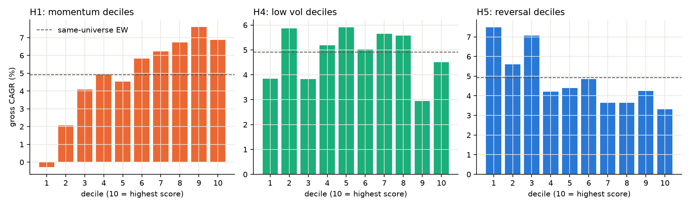
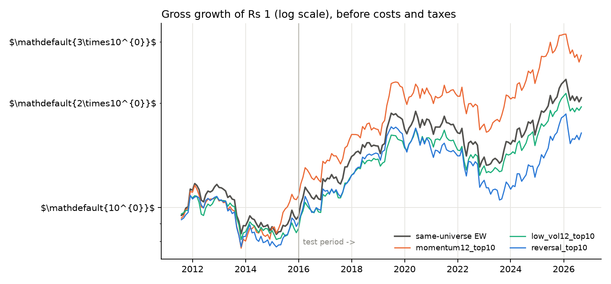
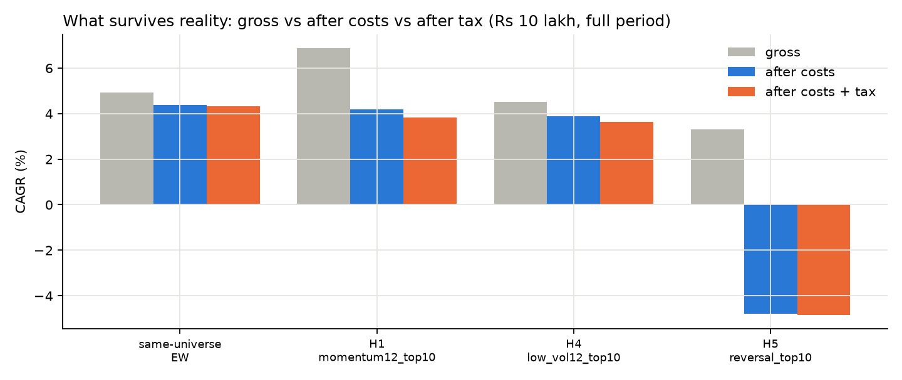
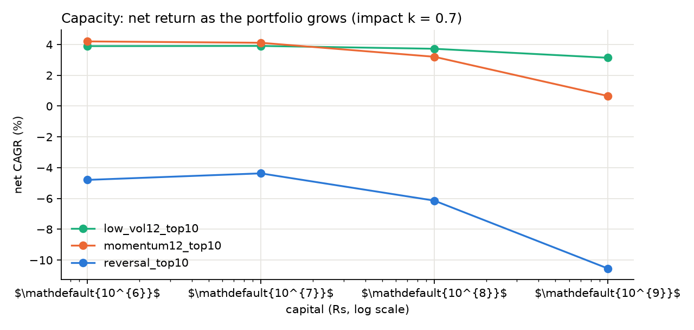
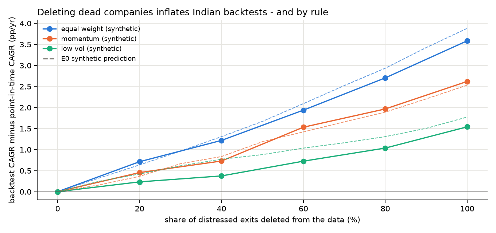

# Results: do equity anomalies survive reality in India? (synthetic data)

*Generated by `scripts/build_report.py` from `results/` - do not edit by hand.*

> **Dry run on a synthetic market with known truth.** These numbers validate the code, they say nothing about India.

## 2. Gross replication (before costs and taxes)

| portfolio | type | CAGR full | CAGR train | CAGR test | Sharpe full | max DD | NW t (mean) |
|---|---|---|---|---|---|---|---|
| same-universe EW | benchmark | 4.9% | 4.9% | 4.9% | 0.41 | -31% | 1.61 |
| momentum12_top10 | long-only top | 6.9% | 7.3% | 6.6% | 0.51 | -34% | 1.93 |
| momentum12_top10 | long-short top-bottom | 7.0% | 9.8% | 5.0% | 0.98 | -11% | 3.59 |
| momentum12_top20 | long-only top | 7.3% | 7.3% | 7.3% | 0.56 | -28% | 2.20 |
| momentum12_top20 | long-short top-bottom | 6.2% | 6.9% | 5.7% | 1.42 | -5% | 5.20 |
| momentum6_top10 | long-only top | 6.7% | 5.5% | 7.6% | 0.51 | -37% | 1.90 |
| momentum6_top10 | long-short top-bottom | 4.6% | 2.5% | 6.2% | 0.65 | -10% | 2.59 |
| momentum6_top20 | long-only top | 6.6% | 6.1% | 7.0% | 0.51 | -31% | 1.98 |
| momentum6_top20 | long-short top-bottom | 3.5% | 1.6% | 4.9% | 0.76 | -6% | 3.06 |
| reversal_top10 | long-only top | 3.3% | 2.9% | 3.6% | 0.29 | -38% | 1.21 |
| reversal_top10 | long-short top-bottom | -4.1% | -6.3% | -2.5% | -0.59 | -49% | -2.21 |
| reversal_top20 | long-only top | 3.8% | 3.6% | 4.0% | 0.33 | -35% | 1.31 |
| reversal_top20 | long-short top-bottom | -2.7% | -4.1% | -1.6% | -0.54 | -36% | -2.13 |
| low_vol12_top10 | long-only top | 4.5% | 3.0% | 5.6% | 0.41 | -27% | 1.67 |
| low_vol12_top10 | long-short top-bottom | -0.1% | -1.2% | 0.7% | 0.03 | -22% | 0.10 |
| low_vol12_top20 | long-only top | 3.8% | 3.8% | 3.7% | 0.35 | -31% | 1.38 |
| low_vol12_top20 | long-short top-bottom | -1.5% | -0.0% | -2.6% | -0.30 | -31% | -1.19 |
| low_vol6_top10 | long-only top | 5.2% | 5.2% | 5.2% | 0.46 | -24% | 1.92 |
| low_vol6_top10 | long-short top-bottom | 0.6% | 1.0% | 0.3% | 0.12 | -22% | 0.45 |
| low_vol6_top20 | long-only top | 4.4% | 4.5% | 4.3% | 0.39 | -29% | 1.59 |
| low_vol6_top20 | long-short top-bottom | -0.1% | 1.6% | -1.3% | 0.01 | -20% | 0.03 |
| high_52w_top10 | long-only top | 8.4% | 9.2% | 7.7% | 0.63 | -27% | 2.59 |
| high_52w_top10 | long-short top-bottom | 7.5% | 6.8% | 8.0% | 1.09 | -10% | 4.09 |
| high_52w_top20 | long-only top | 7.8% | 8.1% | 7.6% | 0.59 | -29% | 2.36 |
| high_52w_top20 | long-short top-bottom | 5.9% | 7.3% | 5.0% | 1.23 | -6% | 4.58 |

## 3. Reality layers
### Gross -> costs -> tax (Rs 10 lakh, impact k = 0.7)

| portfolio | period | gross_cagr | net_cagr | net_after_tax_cagr | net_cagr_brokerage_0.3pct | cost_drag_pp | avg_monthly_turnover | net_max_dd |
|---|---|---|---|---|---|---|---|---|
| same-universe EW | full | 4.9% | 4.4% | 4.3% | 4.1% | +0.54 | 3% | -31.4% |
| same-universe EW | test | 4.9% | 4.5% | 4.5% | 4.2% | +0.44 | 3% | -31.4% |
| H1 momentum12_top10 | full | 6.9% | 4.2% | 3.8% | 1.6% | +2.68 | 29% | -37.4% |
| H1 momentum12_top10 | test | 6.6% | 4.0% | 3.4% | 1.4% | +2.63 | 29% | -33.1% |
| H4 low_vol12_top10 | full | 4.5% | 3.9% | 3.6% | 3.1% | +0.61 | 9% | -27.3% |
| H4 low_vol12_top10 | test | 5.6% | 5.0% | 4.6% | 4.2% | +0.62 | 9% | -27.3% |
| H5 reversal_top10 | full | 3.3% | -4.8% | -4.8% | -12.9% | +8.11 | 88% | -62.4% |
| H5 reversal_top10 | test | 3.6% | -4.7% | -4.7% | -13.5% | +8.28 | 88% | -56.1% |

### Capacity (net CAGR, no tax)

| variant | capital | k = 0.0 | k = 0.7 | k = 1.5 |
|---|---|---|---|---|
| momentum12_top10 | Rs 10 lakh | 4.3% | 4.2% | 4.0% |
| momentum12_top10 | Rs 1 crore | 4.6% | 4.1% | 3.6% |
| momentum12_top10 | Rs 10 crore | 4.6% | 3.2% | 1.8% |
| momentum12_top10 | Rs 100 crore | 4.6% | 0.7% | -2.7% |
| low_vol12_top10 | Rs 10 lakh | 3.9% | 3.9% | 3.9% |
| low_vol12_top10 | Rs 1 crore | 4.0% | 3.9% | 3.8% |
| low_vol12_top10 | Rs 10 crore | 4.0% | 3.7% | 3.4% |
| low_vol12_top10 | Rs 100 crore | 4.0% | 3.1% | 2.2% |
| reversal_top10 | Rs 10 lakh | -4.5% | -4.8% | -5.2% |
| reversal_top10 | Rs 1 crore | -3.4% | -4.4% | -5.4% |
| reversal_top10 | Rs 10 crore | -3.3% | -6.1% | -8.7% |
| reversal_top10 | Rs 100 crore | -3.3% | -10.5% | -15.3% |

### Extended sample from 2007 (robustness; detector-adjusted before Jul 2010), gross

| portfolio | from | CAGR | Sharpe | max DD |
|---|---|---|---|---|
| EW | 2007-02 | 8.3% | 0.63 | -31% |
| momentum12_top10 | 2007-02 | 10.4% | 0.73 | -34% |
| low_vol12_top10 | 2007-02 | 7.2% | 0.61 | -27% |
| reversal_top10 | 2007-02 | 6.9% | 0.52 | -38% |

### Sub-periods (cumulative gross return)

| period | EW | momentum12_top10 | low_vol12_top10 | reversal_top10 |
|---|---|---|---|---|
| 2008 crisis | 36.1% | 44.7% | 32.3% | 35.0% |
| 2013 taper tantrum | -20.5% | -21.8% | -19.1% | -20.9% |
| 2016 demonetisation | 14.2% | 13.2% | 13.4% | 10.4% |
| 2020 Covid | 6.3% | 3.0% | 6.9% | 3.0% |
| 2021-24 retail boom | -1.3% | 15.4% | 1.4% | -14.3% |

### Multiple testing

| period | SPA p | best (SPA) | Reality Check p | variants |
|---|---|---|---|---|
| full | 0.005 | high_52w_top20 | 0.025 | 12 |
| test | 0.003 | momentum6_top20 | 0.166 | 12 |

| variant | Sharpe of excess vs EW | luck threshold | deflated Sharpe prob. | trials |
|---|---|---|---|---|
| momentum12_top10 | 0.45 | 0.91 | 0.031 | 12 |
| low_vol12_top10 | -0.18 | 0.91 | 0.000 | 12 |
| reversal_top10 | -0.31 | 0.91 | 0.000 | 12 |

### Delisting-return sensitivity (gross CAGR)

| terminal_return_distressed | EW | momentum12_top10 | low_vol12_top10 | reversal_top10 |
|---|---|---|---|---|
| 0.0 | 4.9% | 6.9% | 4.5% | 3.3% |
| -0.3 | 4.9% | 6.9% | 4.5% | 3.2% |
| -1.0 | 4.7% | 6.8% | 4.4% | 2.9% |

### Dividends included (from Aug 2010)

| portfolio | price_return_cagr_2010_08_on | total_return_cagr_2010_08_on |
|---|---|---|
| EW | 4.9% | 4.9% |
| momentum12_top10 | 6.9% | 6.9% |
| low_vol12_top10 | 4.5% | 4.5% |
| reversal_top10 | 3.3% | 3.3% |

## 4. Pre-registered hypotheses

| id | claim | evidence | supported |
|---|---|---|---|
| H1 | 12-1 momentum long-short earns a positive gross return | mean 0.58%/month, Newey-West t = 3.59 | yes |
| H2 | Momentum top decile beats same-universe EW net of costs and taxes (test period) | -0.52 pp/yr, 95% CI [-3.62, +2.48] | no |
| H3 | The best grid variant beats EW after correcting for all variants tried | SPA p = 0.005, Reality Check p = 0.025 (12 variants) | yes |
| H4 | Low-volatility decile has a higher Sharpe ratio than EW (gross) | Sharpe 0.41 vs 0.41; 95% CI of difference [-0.10, 0.09] | no |
| H5a | 1-month reversal long-short is profitable gross | mean -0.33%/month, t = -2.21 | no |
| H5b | Reversal top decile does NOT beat EW net of costs (test period) | -9.15 pp/yr, 95% CI [-12.79, -5.58] | yes |

## 5. How much do data shortcuts inflate backtests? (gross CAGR bias, pp/yr)

| view | fraction | equal_weight | low_vol | momentum |
|---|---|---|---|---|
| survivors |  | +2.78 | +0.48 | +2.24 |
| survivors | 0% deleted |  |  |  |
| survivors | 20% deleted |  |  |  |
| survivors | 40% deleted |  |  |  |
| survivors | 60% deleted |  |  |  |
| survivors | 80% deleted |  |  |  |
| survivors | 100% deleted |  |  |  |
| today's top 500 backwards |  | +2.96 | +0.74 | +2.26 |
| today's top 500 backwards | 0% deleted |  |  |  |
| today's top 500 backwards | 20% deleted |  |  |  |
| today's top 500 backwards | 40% deleted |  |  |  |
| today's top 500 backwards | 60% deleted |  |  |  |
| today's top 500 backwards | 80% deleted |  |  |  |
| today's top 500 backwards | 100% deleted |  |  |  |
| vendor |  |  |  |  |
| vendor | 0% deleted | +0.00 | +0.00 | +0.00 |
| vendor | 20% deleted | +0.71 | +0.23 | +0.45 |
| vendor | 40% deleted | +1.22 | +0.37 | +0.73 |
| vendor | 60% deleted | +1.94 | +0.73 | +1.53 |
| vendor | 80% deleted | +2.70 | +1.04 | +1.97 |
| vendor | 100% deleted | +3.58 | +1.54 | +2.62 |

## 6. Known limitations (stated, not fixed)

- Price returns are the primary series; dividend records exist only from Jul 2010.
- Demergers and rights issues are not adjusted (no reliable factor in the records); large unexplained gaps are listed in `results/real/e1_unexplained_gaps.csv`.
- The liquidity-ranked universe approximates, but is not, the Nifty 500.
- Spread and impact are estimated from daily data; no tick data.
- Exchange and SEBI fees use today's rates for all years; STT, stamp duty and taxes are dated.
- Surcharge on tax ignored; tax paid pro-rata without triggering further gains.

## 7. Discussion

*Written by the author.*
